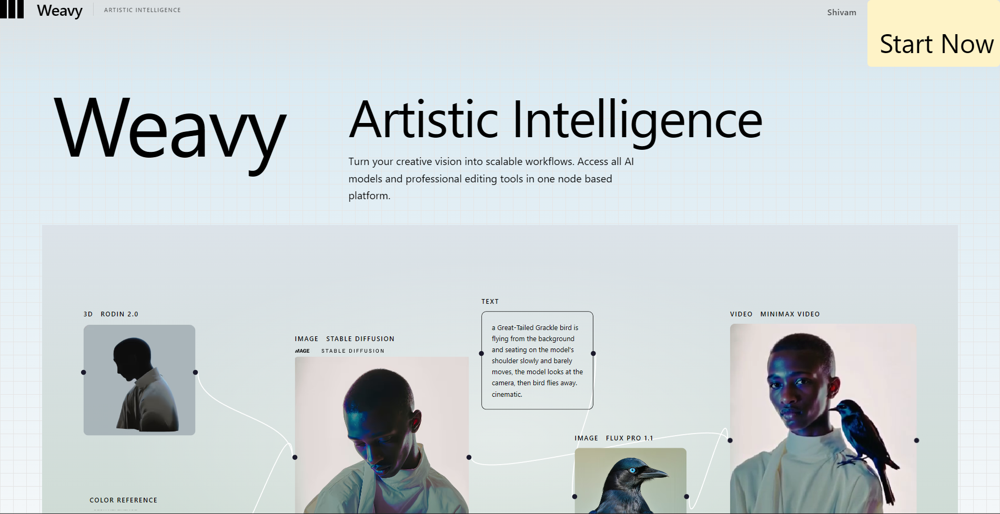
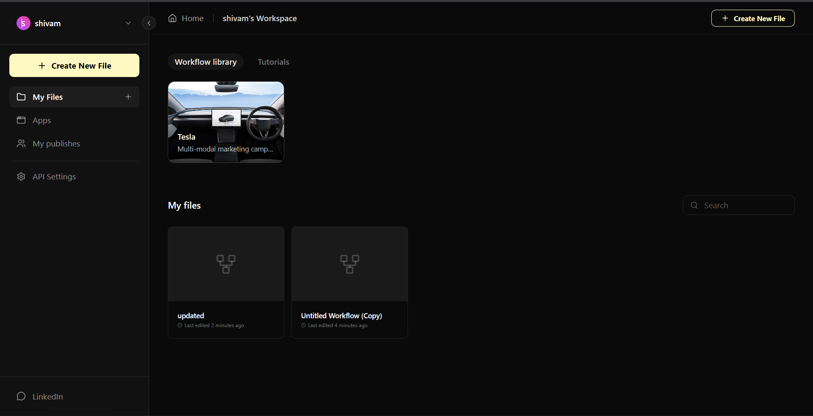
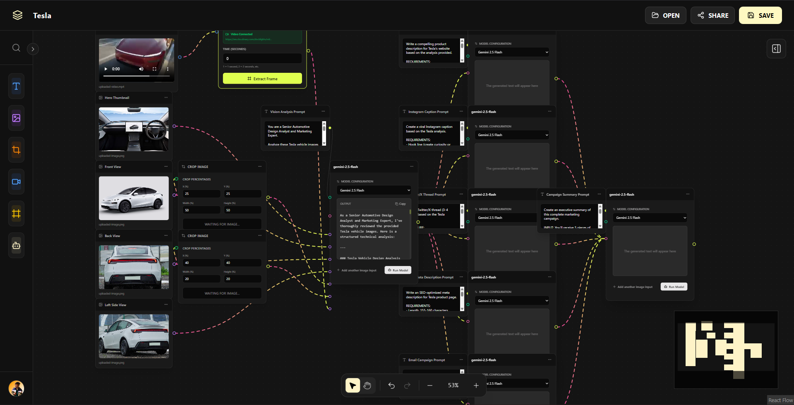
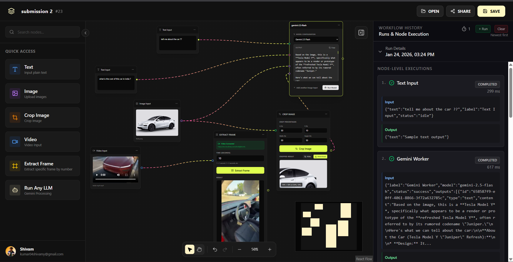
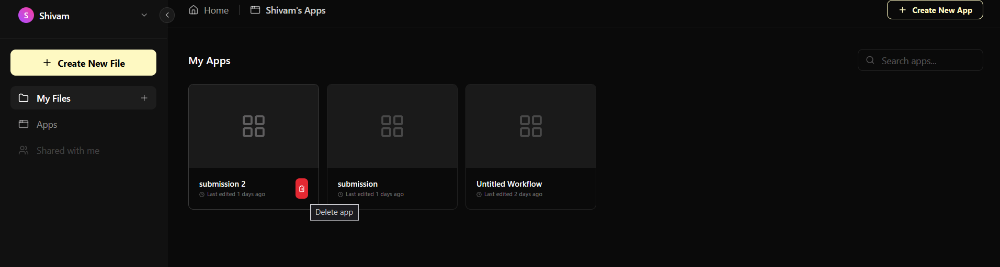
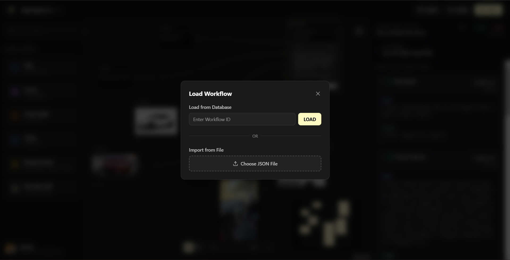

# Weavy Workflow Builder

An advanced AI-powered visual workflow editor built with Next.js 15, TypeScript, and modern web technologies. Create, execute, and manage intelligent workflows with an intuitive node-based canvas interface.

---

## Overview

Weavy Workflow Builder is a production-ready visual workflow platform that enables users to build sophisticated AI automation pipelines through an intuitive drag-and-drop interface. Built with enterprise-grade technologies, it combines powerful LLM capabilities with seamless data processing and reliable execution.

### Core Capabilities

- Visual workflow design with an intuitive node-based canvas
- AI-powered processing using Google Gemini integration
- Advanced image manipulation and analysis pipeline
- Serverless execution with Trigger.dev orchestration
- Persistent storage with PostgreSQL and Prisma ORM
- Enterprise authentication via Clerk
- Professional dark-mode interface with smooth animations

### Use Cases

- No-code AI automation workflows
- Image processing and analysis pipelines
- Content generation and data enrichment
- Rapid workflow prototyping and testing
- Learning modern full-stack architecture patterns

---

## Table of Contents

- [Features](#features)
- [Technology Stack](#technology-stack)
- [Getting Started](#getting-started)
- [Project Architecture](#project-architecture)
- [Development Guide](#development-guide)
- [Deployment](#deployment)
- [Roadmap](#roadmap)
- [Contributing](#contributing)

---

## Demo

This document provides a visual walkthrough of the WeavyxGalaxy application, showcasing its main features and user interface.

### Main Interface
The main landing page of the application.


### Workflow Space
The dedicated space where users can manage and create their workflows.


### Workflow Canvas
The interactive canvas for building and editing workflows using a node-based system.


### Demo with History
An example of a workflow execution, showing the history of the run.


### Customize and Delete
Options for customizing and deleting workflow nodes or elements.


### Share Workflow
The feature to share a created workflow with others.


---

## Features

### Workflow Canvas

- Professional dark-mode interface with dotted grid background
- Smooth pan and zoom controls with minimap navigation
- Real-time visual feedback during workflow execution
- Intuitive drag-and-drop node placement
- Context menus for quick node management
- Undo/redo support for canvas operations

### Node Types

**Image Input Node**
- Direct image upload via Transloadit CDN
- Generates public URLs for workflow processing
- Supports multiple image formats

**Crop Image Node**
- Precise image cropping with percentage-based coordinates
- Real-time preview of crop region
- X, Y, Width, and Height parameter controls

**LLM Processing Node**
- Google Gemini API integration
- Custom prompt configuration
- Supports text and image analysis
- Streaming response support

**Text Node**
- Static text input for workflows
- Variable interpolation ready
- Output connections to downstream nodes

### Execution Engine

- Sequential workflow processing with dependency resolution
- Real-time execution status updates
- Comprehensive error handling and logging
- Serverless execution via Trigger.dev
- Automatic retry logic for failed operations

### Data Management

- Complete workflow execution history
- Timestamped logs with node-level details
- Success/failure status tracking
- JSON-based flexible data storage
- Type-safe data flow validation

### Security & Authentication

- OAuth integration via Clerk
- User-scoped workflow isolation
- Protected API routes
- Secure credential management

---

## Technology Stack

### Frontend
- **Next.js 15** - React framework with App Router
- **TypeScript** - Type-safe development
- **Tailwind CSS** - Utility-first styling
- **React Flow** - Node-based canvas (@xyflow/react)
- **Framer Motion** - Smooth animations
- **Lucide React** - Icon library

### State Management
- **Zustand** - Lightweight state management
- **Zundo** - Undo/redo functionality

### Backend
- **Next.js API Routes** - RESTful endpoints
- **Prisma ORM** - Type-safe database access
- **PostgreSQL** - Relational database (Neon)
- **Trigger.dev** - Serverless workflow orchestration

### External Services
- **Clerk** - Authentication and user management
- **Google Gemini** - LLM processing
- **Transloadit** - File upload and processing
- **Cloudinary** - CDN and media storage

### Development Tools
- **Zod** - Runtime type validation
- **ESLint** - Code quality
- **Prettier** - Code formatting

---

## Getting Started

### Prerequisites

- Node.js 20 or higher
- PostgreSQL database (Neon recommended for free tier)
- Accounts for external services:
  - Clerk (authentication)
  - Google AI Studio (Gemini API)
  - Trigger.dev (workflow execution)
  - Transloadit (file uploads)
  - Cloudinary (media storage)

### Installation

```bash
# Clone the repository
git clone https://github.com/shivamyeshu/WeavyxGalaxy.git
cd weavy-clone-main

# Install dependencies
npm install

# Generate Prisma client
npx prisma generate

# Push database schema
npx prisma db push
```

### Environment Configuration

Create a `.env.local` file in the project root:

```env
# Authentication
NEXT_PUBLIC_CLERK_PUBLISHABLE_KEY=your_clerk_publishable_key
CLERK_SECRET_KEY=your_clerk_secret_key

# AI Services
GEMINI_API_KEY=your_gemini_api_key

# Database
DATABASE_URL=your_postgresql_connection_string

# File Upload
TRANSLOADIT_KEY=your_transloadit_key
TRANSLOADIT_SECRET=your_transloadit_secret
TRANSLOADIT_TEMPLATE_ID=your_template_id

# Workflow Execution
TRIGGER_SECRET_KEY=your_trigger_secret_key
TRIGGER_PROJECT_REF=your_trigger_project_ref

# Media Storage
CLOUDINARY_CLOUD_NAME=your_cloudinary_cloud_name
CLOUDINARY_API_KEY=your_cloudinary_api_key
CLOUDINARY_API_SECRET=your_cloudinary_api_secret
```

### Development Server

```bash
# Start the Next.js development server
npm run dev

# In a separate terminal, start Trigger.dev local development
npx trigger.dev@latest dev

# Access the application at http://localhost:3000
```

---

## Project Architecture

### Directory Structure

```
src/
├── app/                          # Next.js App Router
│   ├── (marketing)/             # Public marketing pages
│   ├── workflows/               # Protected workflow pages
│   │   ├── page.tsx            # Workflow list
│   │   └── [id]/page.tsx       # Workflow editor
│   ├── sign-in/                # Authentication pages
│   ├── sign-up/
│   ├── api/                    # API endpoints
│   │   ├── image/              # Image processing
│   │   ├── llm/                # LLM execution
│   │   ├── video/              # Video processing
│   │   └── workflows/          # Workflow management
│   ├── layout.tsx              # Root layout
│   ├── globals.css             # Global styles
│   └── not-found.tsx           # 404 page
│
├── components/
│   ├── workflow/               # Canvas components
│   │   ├── FlowEditor.tsx      # Main canvas component
│   │   ├── Sidebar.tsx         # Node palette
│   │   ├── Header.tsx          # Workflow controls
│   │   ├── nodes/              # Custom node implementations
│   │   │   ├── ImageNode.tsx
│   │   │   ├── CropImageNode.tsx
│   │   │   ├── LLMNode.tsx
│   │   │   └── TextNode.tsx
│   │   └── edges/              # Custom edge rendering
│   │       └── AnimatedEdge.tsx
│   ├── marketing/              # Landing page components
│   │   ├── Navbar.tsx
│   │   ├── HeroSection.tsx
│   │   ├── EditorSection.tsx
│   │   └── Footer.tsx
│   └── providers/              # React context providers
│       └── AuthProvider.tsx
│
├── lib/
│   ├── db.ts                   # Prisma client instance
│   ├── prisma.ts               # Prisma singleton
│   ├── types.ts                # TypeScript type definitions
│   ├── utils.ts                # Utility functions
│   └── demoWorkflows.ts        # Pre-built workflow templates
│
├── store/
│   └── workflowStore.ts        # Zustand state management
│
├── trigger/
│   ├── workflow-nodes.ts       # Trigger.dev task definitions
│   └── orchestrator.ts         # Workflow execution logic
│
└── middleware.ts               # Clerk authentication middleware

prisma/
├── schema.prisma               # Database schema
└── migrations/                 # Database migrations
```

### Data Flow Architecture

```
User Interface (React Flow Canvas)
        ↓
Zustand Store (workflowStore.ts)
        ↓
API Routes (/api/workflows)
        ↓
Prisma ORM
        ↓
PostgreSQL Database
        ↓
Trigger.dev Orchestration
        ↓
External Services (Gemini, Transloadit)
        ↓
Response → Update Store → UI Updates
```

### State Management Pattern

- **Local State**: React hooks for component-level state
- **Global State**: Zustand for workflow nodes, edges, and execution data
- **Server State**: Prisma for persistent storage
- **Async State**: Trigger.dev for background job processing

---

## Development Guide

### Creating Custom Nodes

1. Create a new node component in `src/components/workflow/nodes/`:

```typescript
import { Handle, Position } from '@xyflow/react';

export function CustomNode({ data, selected }) {
  return (
    <div className={`bg-slate-800 rounded-lg border-2 p-4 ${
      selected ? 'border-yellow-100' : 'border-gray-700'
    }`}>
      <div className="text-sm font-semibold text-white mb-2">
        {data.label}
      </div>
      
      {/* Input handle */}
      <Handle 
        type="target" 
        position={Position.Top}
        className="w-3 h-3 bg-yellow-100"
      />
      
      {/* Your node content */}
      <div className="text-gray-300">
        {/* Add inputs, outputs, controls here */}
      </div>
      
      {/* Output handle */}
      <Handle 
        type="source" 
        position={Position.Bottom}
        className="w-3 h-3 bg-yellow-100"
      />
    </div>
  );
}
```

2. Register the node type in `FlowEditor.tsx`:

```typescript
const nodeTypes = {
  imageNode: ImageNode,
  cropImage: CropImageNode,
  llm: LLMNode,
  textNode: TextNode,
  customNode: CustomNode, // Add your node here
};
```

### Adding Trigger.dev Tasks

Define new tasks in `src/trigger/workflow-nodes.ts`:

```typescript
export const customTask = task({
  id: "custom-task",
  run: async (payload: { input: string }) => {
    // Your processing logic
    const result = await processData(payload.input);
    
    return {
      success: true,
      output: result,
    };
  },
});
```

### Database Schema Changes

After modifying `prisma/schema.prisma`:

```bash
# Create a new migration
npx prisma migrate dev --name description_of_changes

# Regenerate Prisma client
npx prisma generate

# Apply migration to production
npx prisma migrate deploy
```

### Testing Workflows

1. Start development servers
2. Navigate to `/workflows`
3. Create a new workflow
4. Add nodes from the sidebar
5. Connect nodes by dragging from output to input handles
6. Configure node parameters
7. Click "Run Workflow" to execute
8. View results in the execution history panel

---

## Deployment

### Build for Production

```bash
# Create optimized production build
npm run build

# Test production build locally
npm start
```

### Deployment Platforms

**Vercel (Recommended)**
```bash
# Install Vercel CLI
npm i -g vercel

# Deploy
vercel
```

**Docker**
```bash
# Build image
docker build -t weavy-workflow .

# Run container
docker run -p 3000:3000 weavy-workflow
```

### Environment Variables

Ensure all production environment variables are configured in your deployment platform:

- Authentication keys (Clerk)
- API keys (Gemini, Transloadit, Cloudinary)
- Database connection string
- Trigger.dev configuration

---

## Roadmap

### Planned Features

**Phase 1 - Enhanced Nodes**
- Video processing with frame extraction
- Database query nodes
- HTTP request nodes
- File system operations
- Email and SMS notifications

**Phase 2 - Execution Improvements**
- Parallel execution branches
- Conditional logic nodes
- Loop and iteration support
- Error handling and retry strategies
- Workflow debugging tools

**Phase 3 - Collaboration**
- Real-time multi-user editing
- Workflow versioning
- Commenting and annotations
- Team workspaces
- Workflow templates library

**Phase 4 - Enterprise Features**
- Role-based access control
- Audit logging
- Performance monitoring
- Custom integrations API
- Workflow analytics dashboard

---

## Contributing

Contributions are welcome! Here's how to get started:

1. Fork the repository
2. Create a feature branch (`git checkout -b feature/amazing-feature`)
3. Commit your changes (`git commit -m 'Add amazing feature'`)
4. Push to the branch (`git push origin feature/amazing-feature`)
5. Open a Pull Request

### Areas for Contribution

- Additional node types
- UI/UX improvements
- Performance optimizations
- Documentation enhancements
- Bug fixes and testing

### Code Style

- Follow TypeScript best practices
- Use Tailwind CSS for styling
- Write meaningful commit messages
- Add comments for complex logic
- Update documentation for new features

---

## License

This project is licensed under the MIT License. See the [LICENSE](LICENSE) file for details.

---

## Acknowledgments

- Weavy.ai for design inspiration
- Next.js team for the amazing framework
- React Flow for the canvas library
- All open-source contributors

---

## Contact

**Developer**: Shivam Yeshu  
**Location**: Delhi, India  
**GitHub**: [github.com/shivamyeshu](https://github.com/shivamyeshu)  
**LinkedIn**: [linkedin.com/in/shivam-yeshu](https://www.linkedin.com/in/shivam-yeshu)

For questions, issues, or feature requests, please open an issue on GitHub.

---

## Support

Need help?

- Check existing [GitHub Issues](https://github.com/shivamyeshu/WeavyxGalaxy/issues)
- Review inline code documentation
- Explore the `/docs` directory
- Join discussions in the repository

---

